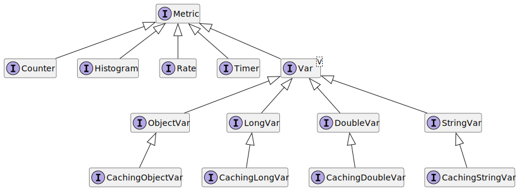

## Metric types and Measurables

`Metric` is a typed named entity measuring a certain set of `Measurable`s.

Metric types implements `com.ringcentral.platform.metrics.Metric` interface.

Metric types provided out of the box:



<details>
<summary>diagram's source code </summary>
@startuml sequence

interface Metric
interface Counter
interface Histogram
interface Rate
interface Timer
interface Var<V>
interface ObjectVar
interface LongVar
interface DoubleVar
interface StringVar
interface CachingObjectVar
interface CachingLongVar
interface CachingDoubleVar
interface CachingStringVar

Metric <|-- Counter
Metric <|-- Histogram
Metric <|-- Rate
Metric <|-- Timer
Metric <|-- Var
Var <|-- ObjectVar
Var <|-- LongVar
Var <|-- DoubleVar
Var <|-- StringVar
ObjectVar <|-- CachingObjectVar 
LongVar <|-- CachingLongVar
DoubleVar <|-- CachingDoubleVar
StringVar <|-- CachingStringVar

hide empty members
@enduml
</details>

As it was said `Metric` is responsible for a certain set of `Measurable`s.

Measurable implements `com.ringcentral.platform.metrics.measurables.Measurable` interface.

Each Measurable identifies its value as one of `com.ringcentral.platform.metrics.measurables.MeasurableType` type: OBJECT, LONG, DOUBLE or STRING.

### Counter

Let's take a look at Counter.

`com.ringcentral.platform.metrics.counter.Counter`  measures exactly one value - the current value of counter. Its `MeasurableType` is LONG.

[First metric creation and export](./first-creation-and-export.md) you can find an example of `Counter`'s usage.

### Histogram

`com.ringcentral.platform.metrics.histogram.Histogram` measures the statistical distribution of `java.lang.Long`.

Supported Measurables:
- ```Counter.COUNT```
- ```Histogram.TOTAL_SUM```
- ```Histogram.MIN```
- ```Histogram.MAX```
- ```Histogram.MEAN```
- ```Histogram.STANDARD_DEVIATION```
- ```Histogram.Percentile``` (including the predefined ```Histogram.PERCENTILE_5```, ```Histogram.PERCENTILE_10```, ...)
- ```Histogram.Bucket``` (including the predefined ```Histogram.MS_10_BUCKET```, ```Histogram.SEC_1_BUCKET```, ...)

There is a basic example of `Histogram` creation and its exporting.

[com.ringcentral.platform.metrics.guide.chapter02.Listing01](../examples/chapter-02/src/main/java/com/ringcentral/platform/metrics/guide/chapter02/Listing01.java)
```java
package com.ringcentral.platform.metrics.guide.chapter02;

import com.ringcentral.platform.metrics.defaultImpl.DefaultMetricRegistry;
import com.ringcentral.platform.metrics.histogram.Histogram;
import com.ringcentral.platform.metrics.names.MetricName;
import com.ringcentral.platform.metrics.reporters.prometheus.PrometheusMetricsExporter;

public class Listing01 {

    public static void main(String[] args) {
        System.out.println(run());
    }

    public static String run() {
        // 1) Create registry
        var registry = new DefaultMetricRegistry();

        // 2) Register metric
        MetricName name = MetricName.of("request", "duration", "seconds");
        Histogram histogram = registry.histogram(name);

        // 3) Let's pretend that there are 3 requests: 5, 10 and 15 seconds long
        histogram.update(5);
        histogram.update(10);
        histogram.update(15);

        // 4) Create exporter
        var exporter = new PrometheusMetricsExporter(registry);

        // 5) Export metrics
        var result = new StringBuilder();
        result.append(exporter.exportMetrics());
        return result.toString();
    }
}
```

Output:

```text
# HELP request_duration_seconds Generated from metric instances with name request.duration.seconds
# TYPE request_duration_seconds summary
request_duration_seconds{quantile="0.5",} 10.0
request_duration_seconds{quantile="0.9",} 15.0
request_duration_seconds{quantile="0.99",} 15.0
request_duration_seconds_count 3.0
# HELP request_duration_seconds_mean Generated from metric instances with name request.duration.seconds
# TYPE request_duration_seconds_mean gauge
request_duration_seconds_mean 10.0
# HELP request_duration_seconds_min Generated from metric instances with name request.duration.seconds
# TYPE request_duration_seconds_min gauge
request_duration_seconds_min 5.0
# HELP request_duration_seconds_max Generated from metric instances with name request.duration.seconds
# TYPE request_duration_seconds_max gauge
request_duration_seconds_max 15.0
```

### Measurable set configuration

It has been said above that Histogram supports Histogram.Bucket and Histogram.STANDARD_DEVIATION Measurables, but output doesn't contain it.

`Metric` has default set of Measurables. For example, `com.ringcentral.platform.metrics.histogram.AbstractHistogram.DEFAULT_HISTOGRAM_MEASURABLES` for `Histogram`. Notice that it doesn't contain any of `Histogram.Bucket` or `Histogram.STANDARD_DEVIATION` Measurables.

You could override set of metrics:
- globally - for all registered Metrics and new ones,
- using filters - override will be applied only to those metrics, which will pass the filter,
- during registration - override will be applied only to the registering metric.

Now we will look only into the last option.

[com.ringcentral.platform.metrics.guide.chapter02.Listing02](../examples/chapter-02/src/main/java/com/ringcentral/platform/metrics/guide/chapter02/Listing02.java)
```java
package com.ringcentral.platform.metrics.guide.chapter02;

import com.ringcentral.platform.metrics.counter.Counter;
import com.ringcentral.platform.metrics.defaultImpl.DefaultMetricRegistry;
import com.ringcentral.platform.metrics.histogram.Histogram;
import com.ringcentral.platform.metrics.names.MetricName;
import com.ringcentral.platform.metrics.reporters.prometheus.PrometheusMetricsExporter;

import static com.ringcentral.platform.metrics.histogram.configs.builders.HistogramConfigBuilder.withHistogram;

public class Listing02 {

    public static void main(String[] args) {
        System.out.println(run());
    }

    public static String run() {
        // 1) Create registry
        var registry = new DefaultMetricRegistry();

        // 2) Register metric
        MetricName name = MetricName.of("request", "duration", "seconds");
        Histogram histogram = registry.histogram(name, () ->
                withHistogram()
                        // 3) Specify custom set of measurables
                        .measurables(
                                Counter.COUNT,
                                Histogram.TOTAL_SUM,
                                Histogram.Bucket.of(5),
                                Histogram.Bucket.of(10),
                                Histogram.Bucket.of(15)
                        )
        );

        // 4) Let's pretend that we had 3 requests: 5, 10 and 15 seconds long
        histogram.update(5);
        histogram.update(10);
        histogram.update(15);

        // 5) Create exporter
        var exporter = new PrometheusMetricsExporter(registry);

        // 6) Export metrics
        var result = new StringBuilder();
        result.append(exporter.exportMetrics());
        return result.toString();
    }
}
```
Output:

```text
# HELP request_duration_seconds Generated from metric instances with name request.duration.seconds
# TYPE request_duration_seconds histogram
request_duration_seconds_bucket{le="5",} 1.0
request_duration_seconds_bucket{le="10",} 2.0
request_duration_seconds_bucket{le="15",} 3.0
request_duration_seconds_bucket{le="+Inf",} 3.0
request_duration_seconds_count 3.0
request_duration_seconds_sum 30.0
```

As expected set of exported metrics changed:
- request_duration_seconds_mean, request_duration_seconds_min, etc aren't present anymore;
- request_duration_seconds_bucket and request_duration_seconds_sum are added;
- request_duration_seconds_count is left as it is.

TODO there should be a table/scheme, which will describe relationships between Metrics and measurables - add here link to it.

In the next part we will learn about labels - [Labeled metrics](./03-labeled-metrics.md).