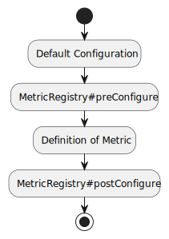

# Configuration 

Table of Contents
============
- [Introduction](#introduction)
- [Configuration "Stages"](#configuration--stages-)
    - [Default](#default)
    - [MetricRegistry#preConfigure](#metricregistry-preconfigure)
    - [Definition of Metric](#definition-of-metric)
    - [MetricRegistry#postConfigure](#metricregistry-postconfigure)
- [Configurable Parameters](#configurable-parameters)
- [Filtering](#filtering)

## Introduction

Metrics Facade provides extremely flexible in terms of `Metric` configuration.
In particular, for each metric you can specify a set of `Measurable`s to be calculated and exported.

`Metric` configurations are applied in the following order - the last applied wins:



<details>
<summary>diagram's source code </summary>
@startuml diagram-01

start
:Default Configuration;
:MetricRegistry#preConfigure;
:Definition of Metric;
:MetricRegistry#postConfigure;
stop

@enduml
</details>

## Configuration "Stages"

### Default
It's a default set of `Measurable`s, which is statically defined in implementation of the corresponding `Metric`.

For example,

- [Rate's set](../../metrics-facade-base/src/main/java/com/ringcentral/platform/metrics/rate/AbstractRate.java) contains COUNT,   MEAN_RATE, ONE_MINUTE_RATE, FIVE_MINUTES_RATE, FIFTEEN_MINUTES_RATE, RATE_UNIT.
- [Histogram's set](../../metrics-facade-base/src/main/java/com/ringcentral/platform/metrics/histogram/AbstractHistogram.java) contains COUNT, MIN, MAX, MEAN, PERCENTILE_50, PERCENTILE_90, PERCENTILE_99. 

[Default histogram configuration](02-metric-types.md#histogram) shows definition of corresponding `Metric` and its usage.  

### MetricRegistry preConfigure

Let's imagine MIN, MAX and MEAN `Measurable`s aren't needed, but they're configured by default. `MetricRegistry#preConfigure` allows us to get rid of undesirable `Measurable`s:

[com.ringcentral.platform.metrics.guide.chapter04.Listing01](../examples/chapter-04/src/main/java/com/ringcentral/platform/metrics/guide/chapter04/Listing01.java)
```java
package com.ringcentral.platform.metrics.guide.chapter04;

import com.ringcentral.platform.metrics.defaultImpl.DefaultMetricRegistry;
import com.ringcentral.platform.metrics.histogram.Histogram;
import com.ringcentral.platform.metrics.names.MetricName;
import com.ringcentral.platform.metrics.reporters.prometheus.PrometheusMetricsExporter;

import static com.ringcentral.platform.metrics.MetricModBuilder.modifying;
import static com.ringcentral.platform.metrics.counter.Counter.COUNT;
import static com.ringcentral.platform.metrics.histogram.Histogram.*;
import static com.ringcentral.platform.metrics.histogram.configs.builders.HistogramConfigBuilder.withHistogram;
import static com.ringcentral.platform.metrics.names.MetricNameMask.allMetrics;

public class Listing01 {

  public static void main(String[] args) {
    System.out.println(run());
  }

  public static String run() {
    // 1) Create registry
    var registry = new DefaultMetricRegistry();

    // 2) Override default Histogram's set of Measurables
    registry.preConfigure(allMetrics(),
            modifying()
                    .histogram(
                            withHistogram()
                                    .measurables(COUNT, TOTAL_SUM, PERCENTILE_50, PERCENTILE_90, PERCENTILE_99)
                    )
    );

    // 3) Register metric
    Histogram histogram = registry.histogram(MetricName.of("histogram", "use", "preConfigure", "measurables"));

    // 4) Some action happens
    for (int i = 0; i < 10; i++) {
      histogram.update(i);
    }

    // 6) Create exporter
    var exporter = new PrometheusMetricsExporter(registry);

    // 7) Export metrics
    return exporter.exportMetrics();
  }
}
```
Output:

```text
# HELP histogram_use_preConfigure_measurables Generated from metric instances with name histogram.use.preConfigure.measurables
# TYPE histogram_use_preConfigure_measurables summary
histogram_use_preConfigure_measurables{quantile="0.5",} 4.0
histogram_use_preConfigure_measurables{quantile="0.9",} 8.0
histogram_use_preConfigure_measurables{quantile="0.99",} 9.0
histogram_use_preConfigure_measurables_count 10.0
histogram_use_preConfigure_measurables_sum 45.0
```

As it's expected _histogram_use_preConfigure_measurables_ has only COUNT, SUM and PERCENTILEs `Measurable`s.


### Definition of Metric

Now let's imagine that for this particular `Metric` statistics should be more granular. We can achieve it by specifying desirable `Measurabe`s during registration of the `Metric`:

[com.ringcentral.platform.metrics.guide.chapter04.Listing02](../examples/chapter-04/src/main/java/com/ringcentral/platform/metrics/guide/chapter04/Listing02.java)
```java
package com.ringcentral.platform.metrics.guide.chapter04;

import com.ringcentral.platform.metrics.defaultImpl.DefaultMetricRegistry;
import com.ringcentral.platform.metrics.histogram.Histogram;
import com.ringcentral.platform.metrics.names.MetricName;
import com.ringcentral.platform.metrics.reporters.prometheus.PrometheusMetricsExporter;

import static com.ringcentral.platform.metrics.MetricModBuilder.modifying;
import static com.ringcentral.platform.metrics.counter.Counter.COUNT;
import static com.ringcentral.platform.metrics.histogram.Histogram.*;
import static com.ringcentral.platform.metrics.histogram.configs.builders.HistogramConfigBuilder.withHistogram;
import static com.ringcentral.platform.metrics.names.MetricNameMask.allMetrics;

public class Listing02 {

  public static void main(String[] args) {
    System.out.println(run());
  }

  public static String run() {
    // 1) Create registry
    var registry = new DefaultMetricRegistry();

    // 2) Override default Histogram's set of Measurables
    registry.preConfigure(allMetrics(),
            modifying()
                    .histogram(
                            withHistogram()
                                    .measurables(COUNT, TOTAL_SUM, PERCENTILE_50, PERCENTILE_90, PERCENTILE_99)
                    )
    );

    // 3) Create Histogram with custom Measurables
    Histogram histogram = registry.histogram(
            MetricName.of("histogram", "override", "defaultAndPreConfigured", "measurables"),
            () -> withHistogram()
                    .measurables(COUNT, TOTAL_SUM, PERCENTILE_10, PERCENTILE_25, PERCENTILE_50, PERCENTILE_90, PERCENTILE_99, PERCENTILE_999)
    );

    // 4) Some action happens
    for (int i = 0; i < 100; i++) {
      histogram.update(i);
    }

    // 6) Create exporter
    var exporter = new PrometheusMetricsExporter(registry);

    // 7) Export metrics
    return exporter.exportMetrics();
  }
}
```
Output:

```text
# HELP histogram_override_defaultAndPreConfigured_measurables Generated from metric instances with name histogram.override.defaultAndPreConfigured.measurables
# TYPE histogram_override_defaultAndPreConfigured_measurables summary
histogram_override_defaultAndPreConfigured_measurables{quantile="0.1",} 9.0
histogram_override_defaultAndPreConfigured_measurables{quantile="0.25",} 24.0
histogram_override_defaultAndPreConfigured_measurables{quantile="0.5",} 49.0
histogram_override_defaultAndPreConfigured_measurables{quantile="0.9",} 89.0
histogram_override_defaultAndPreConfigured_measurables{quantile="0.99",} 98.0
histogram_override_defaultAndPreConfigured_measurables{quantile="0.999",} 99.0
histogram_override_defaultAndPreConfigured_measurables_count 100.0
histogram_override_defaultAndPreConfigured_measurables_sum 4950.0
```
As it's expected _histogram_override_defaultAndPreConfigured_measurables_ measures greater number of PERCENTILE `Measurable`s.

### MetricRegistry postConfigure

Finally, let's imagine that there is environment, within which we're not very interested in the `Metric` - PERCENTILE_99, COUNT and SUM `Measurable`s satisfy completely our needs. `MetricRegistry#postConfigure` allows us to get rid of undesirable `Measurable`s:

[com.ringcentral.platform.metrics.guide.chapter04.Listing03](../examples/chapter-04/src/main/java/com/ringcentral/platform/metrics/guide/chapter04/Listing03.java)
```java
package com.ringcentral.platform.metrics.guide.chapter04;

import com.ringcentral.platform.metrics.defaultImpl.DefaultMetricRegistry;
import com.ringcentral.platform.metrics.histogram.Histogram;
import com.ringcentral.platform.metrics.names.MetricName;
import com.ringcentral.platform.metrics.reporters.prometheus.PrometheusMetricsExporter;

import static com.ringcentral.platform.metrics.MetricModBuilder.modifying;
import static com.ringcentral.platform.metrics.counter.Counter.COUNT;
import static com.ringcentral.platform.metrics.histogram.Histogram.*;
import static com.ringcentral.platform.metrics.histogram.configs.builders.HistogramConfigBuilder.withHistogram;
import static com.ringcentral.platform.metrics.names.MetricNameMask.allMetrics;

public class Listing03 {

  public static void main(String[] args) {
    System.out.println(run());
  }

  public static String run() {
    // 1) Create registry
    var registry = new DefaultMetricRegistry();

    // 2) Override default Histogram's set of Measurables
    registry.preConfigure(allMetrics(),
            modifying()
                    .histogram(
                            withHistogram()
                                    .measurables(COUNT, TOTAL_SUM, PERCENTILE_50, PERCENTILE_90, PERCENTILE_99)
                    )
    );

    // 3) Override any other custom definition of Histogram's set of Measurables
    registry.postConfigure(allMetrics(),
            modifying()
                    .histogram(
                            withHistogram()
                                    .measurables(COUNT, TOTAL_SUM, PERCENTILE_99)
                    )
    );

    // 4) Create Histogram with custom set of Measurables
    Histogram histogram = registry.histogram(
            MetricName.of("histogram", "override", "defaultAndPreConfiguredAndCustom", "measurables"),
            () -> withHistogram()
                    .measurables(COUNT, TOTAL_SUM, PERCENTILE_10, PERCENTILE_25, PERCENTILE_50, PERCENTILE_90, PERCENTILE_99, PERCENTILE_999)
    );

    // 5) Some action happens
    for (int i = 0; i < 100; i++) {
      histogram.update(i);
    }

    // 6) Create exporter
    var exporter = new PrometheusMetricsExporter(registry);

    // 7) Export metrics
    return exporter.exportMetrics();
  }
}
```
Output:

```text
# HELP histogram_override_defaultAndPreConfiguredAndCustom_measurables Generated from metric instances with name histogram.override.defaultAndPreConfiguredAndCustom.measurables
# TYPE histogram_override_defaultAndPreConfiguredAndCustom_measurables summary
histogram_override_defaultAndPreConfiguredAndCustom_measurables{quantile="0.99",} 98.0
histogram_override_defaultAndPreConfiguredAndCustom_measurables_count 100.0
histogram_override_defaultAndPreConfiguredAndCustom_measurables_sum 4950.0
```
As it's expected _histogram_override_defaultAndPreConfiguredAndCustom_measurables_ has only PERCENTILE_99, COUNT and SUM `Measurable`s.

## Configurable Parameters

Before there were only examples of `Measurable`s set configuration, but range of parameters you could set is much wider.

For example,
[com.ringcentral.platform.metrics.guide.chapter04.Listing04](../examples/chapter-04/src/main/java/com/ringcentral/platform/metrics/guide/chapter04/Listing04.java)
```java
package com.ringcentral.platform.metrics.guide.chapter04;

import com.ringcentral.platform.metrics.defaultImpl.DefaultMetricRegistry;
import com.ringcentral.platform.metrics.histogram.Histogram;
import com.ringcentral.platform.metrics.labels.Label;
import com.ringcentral.platform.metrics.labels.LabelValues;
import com.ringcentral.platform.metrics.names.MetricName;
import com.ringcentral.platform.metrics.reporters.prometheus.PrometheusMetricsExporter;

import static com.ringcentral.platform.metrics.MetricModBuilder.modifying;
import static com.ringcentral.platform.metrics.configs.builders.BaseMetricConfigBuilder.withMetric;
import static com.ringcentral.platform.metrics.counter.Counter.COUNT;
import static com.ringcentral.platform.metrics.histogram.Histogram.*;
import static com.ringcentral.platform.metrics.histogram.configs.builders.HistogramConfigBuilder.withHistogram;
import static com.ringcentral.platform.metrics.labels.LabelValues.labelValues;
import static com.ringcentral.platform.metrics.names.MetricNameMask.allMetrics;

public class Listing04 {

  public static void main(String[] args) {
    System.out.println(run());
  }

  public static String run() {
    // 1) Create registry
    var registry = new DefaultMetricRegistry();

    // 2) Create prefix label
    var prefixLabel = new Label("prefix");
    LabelValues defaultLabels = labelValues(prefixLabel.value("prefix-value"));

    // 3) Configure label prefix for all metrics
    registry.preConfigure(allMetrics(),
            modifying()
                    .metric(withMetric().prefix(defaultLabels))
                    .histogram(
                            withHistogram()
                                    .measurables(COUNT, TOTAL_SUM, PERCENTILE_50, PERCENTILE_90, PERCENTILE_99))
    );

    // 4) Create Histogram with custom set of Measurables
    Histogram histogram = registry.histogram(MetricName.of("histogram", "metric", "example"));

    // 5) Some action happens
    for (int i = 0; i < 10; i++) {
      histogram.update(i);
    }

    // 6) Create exporter
    var exporter = new PrometheusMetricsExporter(registry);

    // 7) Export metrics
    return exporter.exportMetrics();
  }
}

```
Output:

```text
# HELP histogram_metric_example Generated from metric instances with name histogram.metric.example
# TYPE histogram_metric_example summary
histogram_metric_example{prefix="prefix-value",quantile="0.5",} 4.0
histogram_metric_example{prefix="prefix-value",quantile="0.9",} 8.0
histogram_metric_example{prefix="prefix-value",quantile="0.99",} 9.0
histogram_metric_example_count{prefix="prefix-value",} 10.0
histogram_metric_example_sum{prefix="prefix-value",} 45.0
```
As it's expected _histogram_metric_example_ has configured label prefix.

To see more parameters see link !!! TODO add link !!!

## Filtering

There is a way to define a predicate, which will be used to filter `Metric`s, for which specified configuration must have an effect.

Let's imaging that there is a third-party library, which registers its own `Metric`s, which we aren't interested in a lot. We could do the following to reduce amount of measured `Metrics`:

For example,
[com.ringcentral.platform.metrics.guide.chapter04.Listing05](../examples/chapter-04/src/main/java/com/ringcentral/platform/metrics/guide/chapter04/Listing05.java)
```java
package com.ringcentral.platform.metrics.guide.chapter04;

import com.ringcentral.platform.metrics.defaultImpl.DefaultMetricRegistry;
import com.ringcentral.platform.metrics.histogram.Histogram;
import com.ringcentral.platform.metrics.labels.Label;
import com.ringcentral.platform.metrics.labels.LabelValues;
import com.ringcentral.platform.metrics.names.MetricName;
import com.ringcentral.platform.metrics.reporters.prometheus.PrometheusMetricsExporter;

import static com.ringcentral.platform.metrics.MetricModBuilder.modifying;
import static com.ringcentral.platform.metrics.configs.builders.BaseMetricConfigBuilder.withMetric;
import static com.ringcentral.platform.metrics.counter.Counter.COUNT;
import static com.ringcentral.platform.metrics.histogram.Histogram.*;
import static com.ringcentral.platform.metrics.histogram.configs.builders.HistogramConfigBuilder.withHistogram;
import static com.ringcentral.platform.metrics.labels.LabelValues.labelValues;
import static com.ringcentral.platform.metrics.names.MetricNameMask.allMetrics;
import static com.ringcentral.platform.metrics.names.MetricNameMask.metricsWithNamePrefix;

public class Listing05 {

  public static void main(String[] args) {
    System.out.println(run());
  }

  public static String run() {
    // 1) Create registry
    var registry = new DefaultMetricRegistry();

    // 2) Reduce amount of Measurables for third party's Metrics
    registry.postConfigure(
            metricsWithNamePrefix("third.party"),
            modifying()
                    .histogram(
                            withHistogram()
                                    .measurables(COUNT, TOTAL_SUM, PERCENTILE_99)
                    )
    );

    // 3) Third party's Metric
    Histogram thirdPartyHistogram = registry.histogram(
            MetricName.of("third", "party", "histogram"),
            () -> withHistogram()
                    .measurables(COUNT, TOTAL_SUM, PERCENTILE_50, PERCENTILE_90, PERCENTILE_99, PERCENTILE_999)
    );

    // 3) App's Metric
    Histogram appHistogram = registry.histogram(MetricName.of("app", "histogram"),
            () -> withHistogram()
                    .measurables(COUNT, TOTAL_SUM, PERCENTILE_50, PERCENTILE_90, PERCENTILE_99));

    // 5) Some action happens
    for (int i = 0; i < 10; i++) {
      appHistogram.update(i);
      thirdPartyHistogram.update(i);
    }

    // 6) Create exporter
    var exporter = new PrometheusMetricsExporter(registry);

    // 7) Export metrics
    return exporter.exportMetrics();
  }
}
```
Output:

```text
# HELP third_party_histogram Generated from metric instances with name third.party.histogram
# TYPE third_party_histogram summary
third_party_histogram{quantile="0.99",} 9.0
third_party_histogram_count 10.0
third_party_histogram_sum 45.0
# HELP app_histogram Generated from metric instances with name app.histogram
# TYPE app_histogram summary
app_histogram{quantile="0.5",} 4.0
app_histogram{quantile="0.9",} 8.0
app_histogram{quantile="0.99",} 9.0
app_histogram_count 10.0
app_histogram_sum 45.0
```

As you can see "third party's" `Metric` has reduced set of `Measurable`s as it's expected.

To see existing filters and examples of their usages see link !!! TODO add link (java docs/dedicated chapter / com.ringcentral.platform.metrics.names.MetricNameMask.forMetricsMatchingNameMask
) !!!
